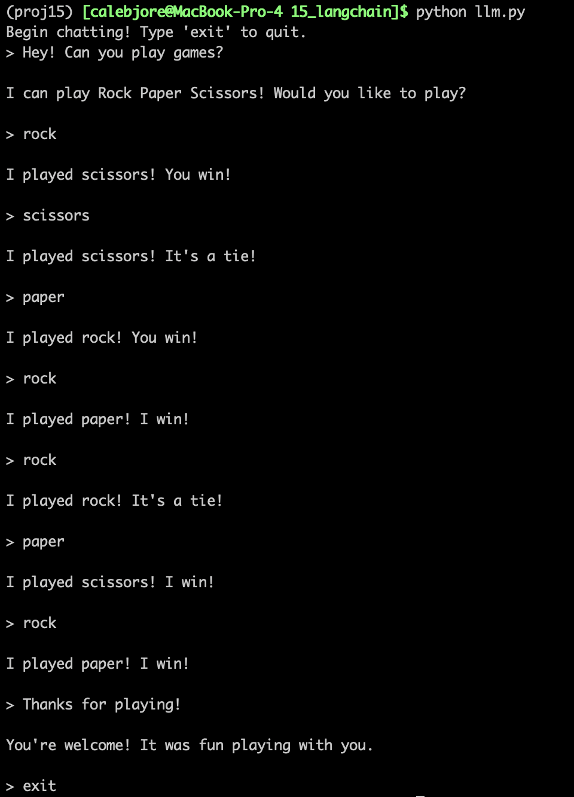

Play rock paper scissors with Gemini in your terminal!

I built this to learn the basics of LangChain—creating agents, working with tools, and enabling short-term memory. By default, a LangChain agent has neither short-term memory nor a capacity to sustain a fair game of rock paper scissors (my early models had a devious tendency to choose their move only after the user had chosen theirs, leading to a, uh, one-sided game).

To solve this, I created a custom `rock_paper_scissors` tool that generates a random number, maps it via modulus to one of the three moves, and instructs the model to stick with that move regardless of what the user posts.

To use, create a `.env` file with your Google API key as demonstrated in `.env.sample`. Then run `llm.py` in your terminal!

Here's Gemini coming back to beat me in a thrilling best of 5 match: 

